# Architecture Guide

This document describes the internal architecture of pg-retest for developers who want to understand, modify, or extend the codebase.

## High-Level Architecture

pg-retest follows a four-stage pipeline: capture a workload, store it as a portable profile, replay it against a target database, and compare the results.

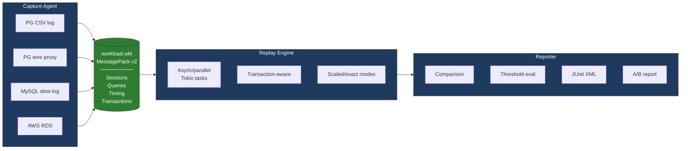

Each stage is fully decoupled. Capture produces a `.wkl` file. Replay consumes it. They never require simultaneous access to source and target databases. This means you can capture on Monday, ship the file, and replay on Friday on a completely different machine.

## Crate Structure

pg-retest is structured as both a library crate (`src/lib.rs`) and a binary crate (`src/main.rs`).

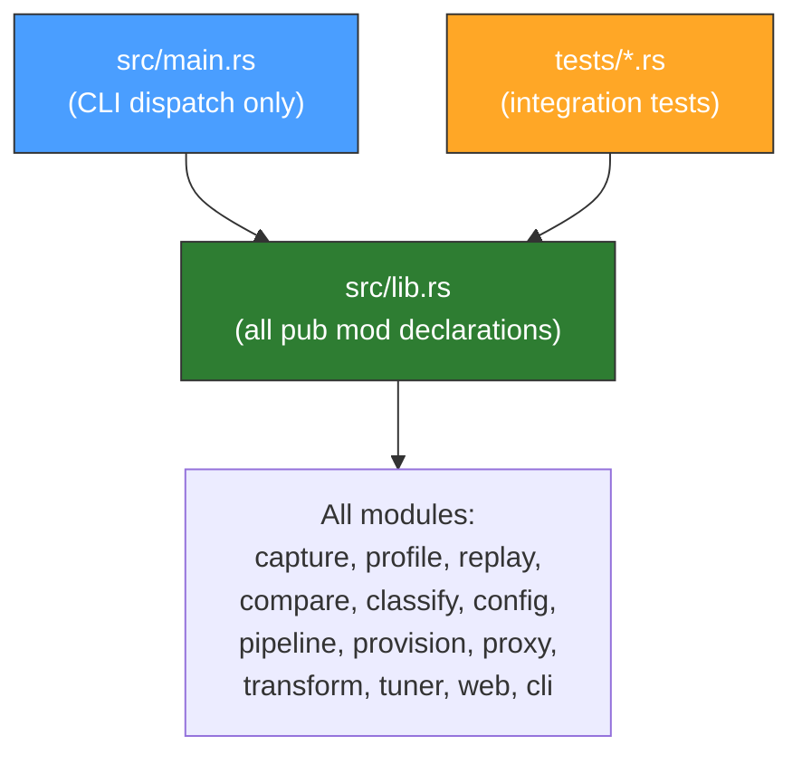

**Why this split matters:** Integration tests in `tests/` import from the library crate via `use pg_retest::...`. If modules were declared in `main.rs` instead of `lib.rs`, the test crate would not be able to access them. This is a Rust convention for projects that need both a CLI and testable internals.

- `src/lib.rs` -- Declares all `pub mod` entries. Contains zero logic.
- `src/main.rs` -- CLI dispatch only. Parses args via Clap, calls into library functions, handles process exit codes.

All public module declarations go in `lib.rs`. Never add `pub mod` to `main.rs`.

## Module Map

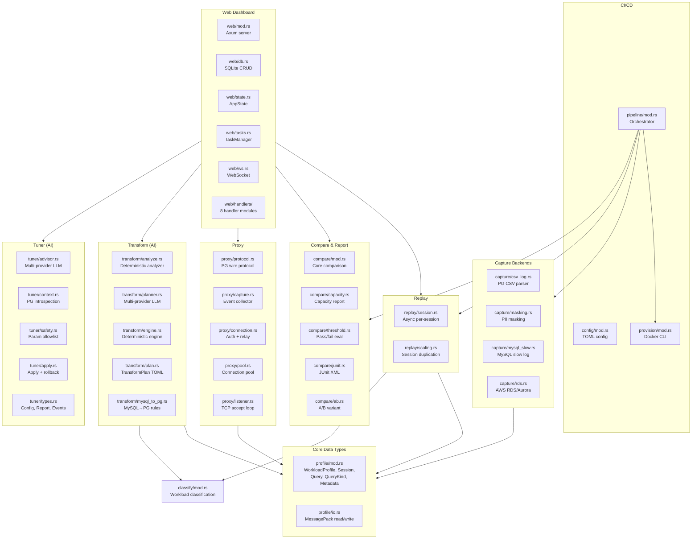

### Core Data Types

| Module | File | Purpose |
|--------|------|---------|
| `profile` | `src/profile/mod.rs` | Core data types: `WorkloadProfile`, `Session`, `Query`, `QueryKind`, `Metadata`. Also contains `assign_transaction_ids()` for marking queries with transaction boundaries. |
| `profile::io` | `src/profile/io.rs` | MessagePack serialization/deserialization. `read_profile()` and `write_profile()` for `.wkl` files. |

### Capture Backends

| Module | File | Purpose |
|--------|------|---------|
| `capture` | `src/capture/mod.rs` | Parent module. Re-exports submodules. |
| `capture::csv_log` | `src/capture/csv_log.rs` | PostgreSQL CSV log parser. Reads PG's CSV log format, groups queries by session (PID), computes timing offsets, assigns transaction IDs. Skips bind/parse entries to avoid duplication with execute entries. |
| `capture::masking` | `src/capture/masking.rs` | PII masking via hand-written character-level state machine. Replaces string literals with `$S` and numeric literals with `$N`. Handles escaped quotes, dollar-quoting, and identifiers containing numbers. |
| `capture::mysql_slow` | `src/capture/mysql_slow.rs` | MySQL slow query log parser. Parses MySQL's slow log format, applies the SQL transform pipeline automatically to convert MySQL syntax to PG-compatible SQL. Skips MySQL-specific commands (`SHOW`, `SET NAMES`, `USE`). |
| `capture::rds` | `src/capture/rds.rs` | AWS RDS/Aurora log capture. Downloads log files via the `aws` CLI with pagination (`--marker`), then delegates to `CsvLogCapture` for parsing. Handles files >1MB via chunked download. |

### Replay

| Module | File | Purpose |
|--------|------|---------|
| `replay` | `src/replay/mod.rs` | Defines `ReplayMode` (ReadWrite/ReadOnly), `ReplayResults`, and `QueryResult` structs. |
| `replay::session` | `src/replay/session.rs` | Async per-session replay engine. Uses Tokio + tokio-postgres. Spawns one task per session for connection-level parallelism. Transaction-aware: auto-rollback on error, skip remaining queries in failed transaction. Supports speed multiplier (0 = max speed). |
| `replay::scaling` | `src/replay/scaling.rs` | Session duplication for load testing. `scale_sessions()` for uniform scaling. `scale_sessions_by_class()` for per-category scaling (scale analytical 2x, transactional 4x, etc.). Uses monotonic ID counter and global stagger counter to avoid ID collisions. |

### Classification

| Module | File | Purpose |
|--------|------|---------|
| `classify` | `src/classify/mod.rs` | Workload classification. Categorizes sessions as Analytical, Transactional, Mixed, or Bulk based on read/write ratio, average latency, and transaction count. `WorkloadClass` derives `Hash` for use as HashMap key. |

### Comparison and Reporting

| Module | File | Purpose |
|--------|------|---------|
| `compare` | `src/compare/mod.rs` | Core comparison logic. `compute_comparison()` pairs source vs. replay metrics. Produces `ComparisonReport` with latency percentiles, error counts, and regression list. |
| `compare::report` | `src/compare/report.rs` | Terminal and JSON report output. |
| `compare::capacity` | `src/compare/capacity.rs` | Scaled replay reporting. Computes throughput QPS, latency percentiles, error rate for capacity planning. |
| `compare::threshold` | `src/compare/threshold.rs` | Threshold-based pass/fail evaluation. Checks p95, p99, error rate, regression count against configured limits. |
| `compare::junit` | `src/compare/junit.rs` | JUnit XML output for CI/CD integration. |
| `compare::ab` | `src/compare/ab.rs` | A/B variant comparison. Per-query regression detection using positional matching, winner determination by average latency, terminal and JSON reporting. |

### SQL Transform Pipeline

| Module | File | Purpose |
|--------|------|---------|
| `transform` | `src/transform/mod.rs` | `SqlTransformer` trait, `TransformPipeline` (composable chain), `TransformResult` enum (Transformed/Skipped/Unchanged), and `TransformReport` for summary stats. |
| `transform::mysql_to_pg` | `src/transform/mysql_to_pg.rs` | MySQL-to-PostgreSQL transform rules. Regex-based: backticks to double quotes, `LIMIT offset, count` to `LIMIT count OFFSET offset`, `IFNULL` to `COALESCE`, `IF(cond, a, b)` to `CASE WHEN cond THEN a ELSE b END`, `UNIX_TIMESTAMP()` to `EXTRACT(EPOCH FROM ...)`. |
| `transform::analyze` | `src/transform/analyze.rs` | Deterministic workload analyzer. Extracts tables via regex, groups by co-occurrence using Union-Find, extracts filter columns. Produces `WorkloadAnalysis` for LLM context. |
| `transform::plan` | `src/transform/plan.rs` | TransformPlan data types (TOML/JSON serde): `QueryGroup`, `TransformRule` (Scale/Inject/InjectSession/Remove), `PlanSource`, `PlanAnalysis`. |
| `transform::planner` | `src/transform/planner.rs` | Multi-provider LLM planner: `LlmPlanner` async trait with `ClaudePlanner` (tool_use), `OpenAiPlanner` (function_calling), `GeminiPlanner` (functionDeclarations), `BedrockPlanner` (AWS CLI Converse), `OllamaPlanner` (JSON mode). |
| `transform::engine` | `src/transform/engine.rs` | Deterministic transform engine: `apply_transform()` applies a TransformPlan to a WorkloadProfile (weighted session duplication, query injection with seeded RNG, group removal). |

### AI-Assisted Tuner

| Module | File | Purpose |
|--------|------|---------|
| `tuner` | `src/tuner/mod.rs` | `run_tuning()` orchestrator. Configurable iteration loop: collect context → LLM → safety → apply → replay → compare → auto-rollback on p95 regression. |
| `tuner::types` | `src/tuner/types.rs` | `Recommendation` (Config/Index/QueryRewrite/SchemaChange), `TuningConfig`, `TuningIteration`, `TuningReport`, `TuningEvent` enum (including RollbackStarted/RollbackCompleted). |
| `tuner::context` | `src/tuner/context.rs` | PG introspection: collects `pg_settings`, schema info, `pg_stat_statements` (optional), EXPLAIN plans for SELECT queries. |
| `tuner::advisor` | `src/tuner/advisor.rs` | `TuningAdvisor` async trait with `ClaudeAdvisor`, `OpenAiAdvisor`, `GeminiAdvisor`, `BedrockAdvisor`, `OllamaAdvisor`. 120s request timeout. |
| `tuner::safety` | `src/tuner/safety.rs` | Parameter allowlist (~41 safe PG params), blocked SQL patterns, production hostname check (blocks "prod", "production", "primary", "master", "main"). |
| `tuner::apply` | `src/tuner/apply.rs` | Applies recommendations to target PG: `ALTER SYSTEM SET` + `pg_reload_conf()` for config, `CREATE INDEX` for indexes, DDL execution for schema changes. Rollback tracking: config via `ALTER SYSTEM RESET`, indexes via `DROP INDEX`. |

### Proxy

| Module | File | Purpose |
|--------|------|---------|
| `proxy` | `src/proxy/mod.rs` | `ProxyConfig`, `run_proxy()` (CLI mode with signal shutdown), `run_proxy_managed()` (web UI mode with CancellationToken). |
| `proxy::protocol` | `src/proxy/protocol.rs` | PG wire protocol message frame parser. Reads/writes `PgMessage` structs. Handles startup messages (SSLRequest, CancelRequest, StartupMessage), type byte extraction, and content parsing (query text, auth message types). |
| `proxy::capture` | `src/proxy/capture.rs` | `CaptureEvent` channel-based event collection. `run_collector()` aggregates events into per-session query lists. `build_profile()` converts collected data into a `WorkloadProfile`. |
| `proxy::connection` | `src/proxy/connection.rs` | Per-connection relay handler. Manages startup handshake, SCRAM-SHA-256 authentication relay, and bidirectional message relay between client and server. Uses BufReader/BufWriter with strategic flush points (flush server immediately, flush client on ReadyForQuery). |
| `proxy::pool` | `src/proxy/pool.rs` | Session-mode connection pool. Checkout/checkin/discard pattern with `tokio::sync::Notify` for waiters. Each client gets a dedicated server connection. |
| `proxy::listener` | `src/proxy/listener.rs` | TCP accept loop. Assigns session IDs via `AtomicU64` counter. Spawns a connection handler per accepted client. Optionally sends metrics events for web UI live traffic display. |

### CI/CD Pipeline

| Module | File | Purpose |
|--------|------|---------|
| `config` | `src/config/mod.rs` | TOML pipeline config parsing and validation. `PipelineConfig` with sections for capture, provision, replay, thresholds, output, and A/B variants. |
| `pipeline` | `src/pipeline/mod.rs` | CI/CD pipeline orchestrator. Executes stages in order: capture, provision, replay, compare, threshold evaluation, report generation. Exit codes: 0=pass, 1=threshold violation, 2=config error, 3=capture error, 4=provision error, 5=replay error. |
| `provision` | `src/provision/mod.rs` | Docker provisioner via CLI subprocess (`docker run`, `docker exec`, `docker rm`). Starts containers, restores backups, provides connection strings. Uses CLI subprocess instead of bollard crate for simplicity. |

### Web Dashboard

| Module | File | Purpose |
|--------|------|---------|
| `web` | `src/web/mod.rs` | Axum HTTP server entry point. Embeds static files via `rust-embed`. SPA fallback (serves `index.html` for non-API routes). `run_server()` initializes SQLite, builds router, starts listener. |
| `web::routes` | `src/web/routes.rs` | Router construction. All API endpoints nested under `/api/v1/`. Routes for health, WebSocket, workloads, proxy, replay, compare, A/B, pipeline, runs, transform, and tuning. |
| `web::state` | `src/web/state.rs` | `AppState` struct: SQLite connection (Arc<Mutex<Connection>>), data directory path, WebSocket broadcast channel (broadcast::Sender<WsMessage>), and TaskManager (Arc<TaskManager>). |
| `web::db` | `src/web/db.rs` | SQLite schema initialization and CRUD operations for workloads, runs, proxy sessions, threshold results, and tuning reports. |
| `web::tasks` | `src/web/tasks.rs` | `TaskManager` for background operations (proxy, replay, pipeline). Spawn/cancel/status/cleanup. Each task gets a `CancellationToken` and a `JoinHandle`. |
| `web::ws` | `src/web/ws.rs` | WebSocket handler. `WsMessage` enum with variants for proxy events, replay progress, pipeline stages, A/B results, tuning iterations, rollback events, and errors. Broadcast channel pushes to all connected clients. |
| `web::handlers::workloads` | `src/web/handlers/workloads.rs` | Upload (multipart), import (from path), list, inspect, classify, and delete workload profiles. |
| `web::handlers::replay` | `src/web/handlers/replay.rs` | Start, cancel, and check status of replay tasks. Progress broadcast via WebSocket. |
| `web::handlers::compare` | `src/web/handlers/compare.rs` | Compute comparison reports, store and retrieve results. |
| `web::handlers::proxy` | `src/web/handlers/proxy.rs` | Start/stop proxy with WebSocket live traffic display. Uses `OnceLock<Arc<RwLock<ProxyState>>>` for module-level proxy state. |
| `web::handlers::ab` | `src/web/handlers/ab.rs` | Start A/B tests (sequential replay per variant), check status. |
| `web::handlers::pipeline` | `src/web/handlers/pipeline.rs` | Validate and execute pipeline configs. |
| `web::handlers::runs` | `src/web/handlers/runs.rs` | Historical run listing, filtering by type/status, trend data for graphs. |
| `web::handlers::transform` | `src/web/handlers/transform.rs` | Transform API: analyze workload, generate plan, apply plan. 3-step wizard. |
| `web::handlers::tuning` | `src/web/handlers/tuning.rs` | Tuning API: start tuning, check status/cancel, retrieve reports. Real-time progress via WebSocket. |

### CLI

| Module | File | Purpose |
|--------|------|---------|
| `cli` | `src/cli.rs` | Clap derive-based CLI argument structs. 11 subcommands: `capture`, `replay`, `compare`, `inspect`, `proxy`, `run`, `ab`, `web`, `transform`, `tune`. |

## Data Flow

### 1. Capture

Capture produces a `WorkloadProfile` from a source. The source varies by backend:

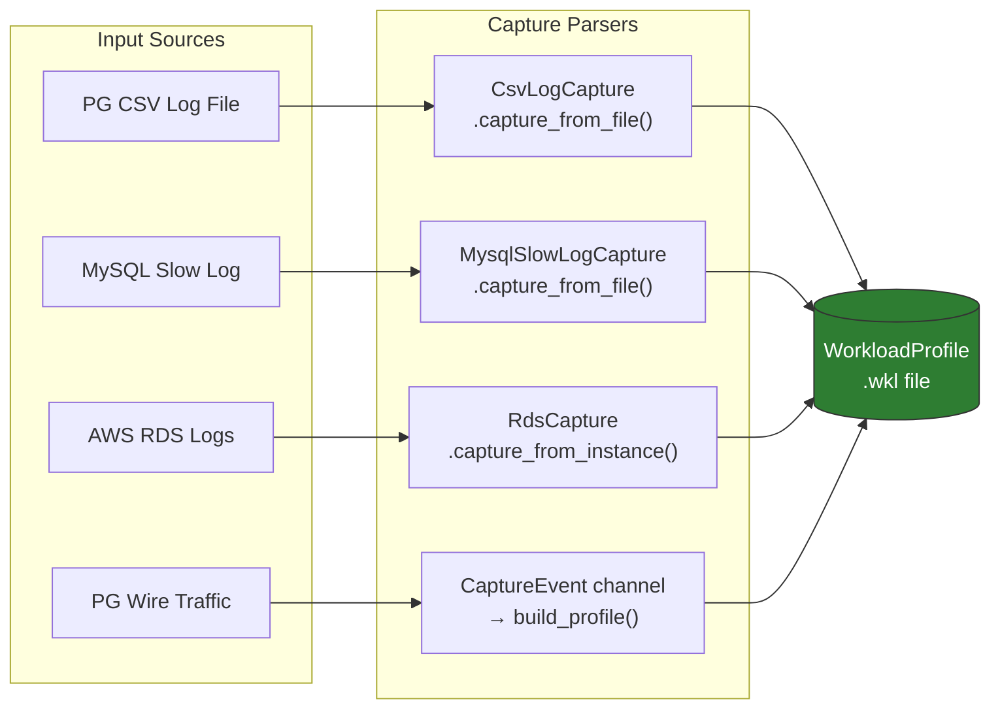

All backends produce the same output: a `WorkloadProfile` containing `Session` objects, each with a list of `Query` objects that carry SQL text, timing offsets, duration, kind classification, and optional transaction ID.

The profile is serialized to a `.wkl` file via MessagePack.

### 2. Replay

Replay reads a `.wkl` file and executes queries against a target PostgreSQL instance:

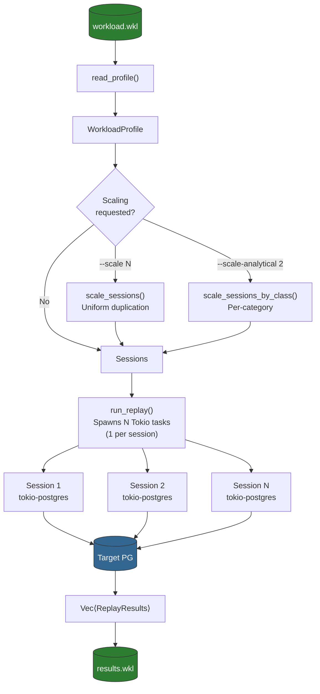

Each session replays on its own Tokio task with a dedicated database connection. Queries are timed relative to a shared replay start instant, preserving the original inter-query timing (adjusted by the speed multiplier). Transaction boundaries are respected: if a query inside a transaction fails, the replay engine issues a ROLLBACK and skips remaining queries in that transaction.

### 3. Comparison

The comparison stage pairs source workload metrics with replay results:

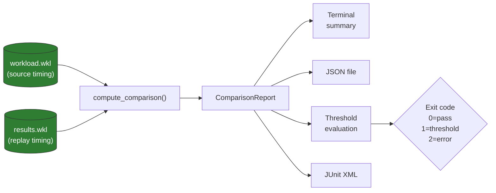

The `ComparisonReport` includes: latency percentiles (p50, p95, p99) for both source and replay, error counts, and a list of regressions (queries that slowed down beyond the threshold percentage).

### 4. CI/CD Pipeline

The pipeline orchestrator chains the stages together:

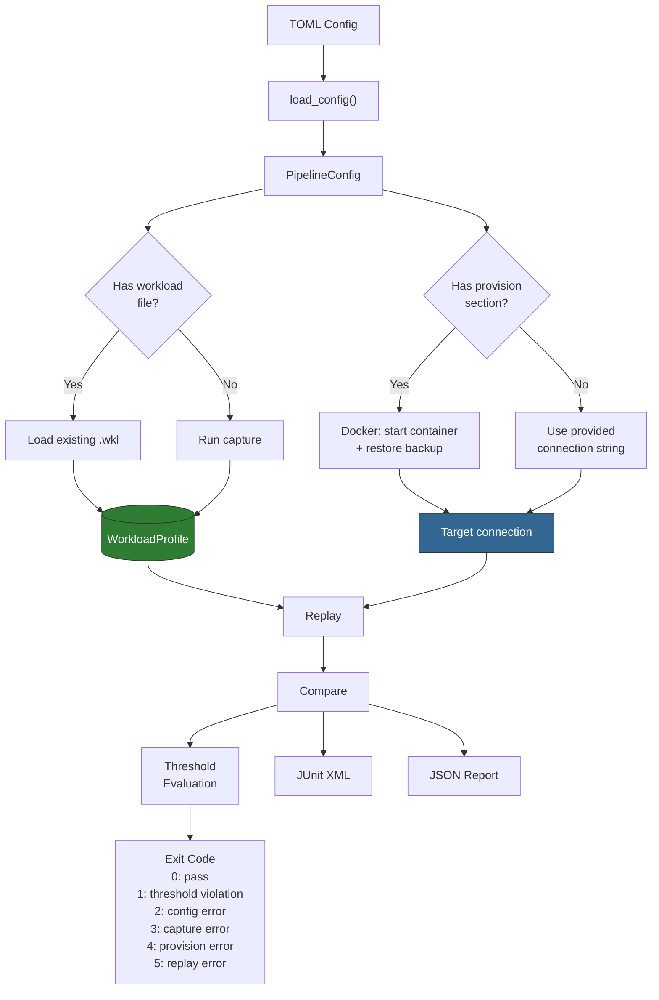

### 5. AI Workload Transform

The transform uses a 3-layer architecture: deterministic analysis, AI planning, deterministic execution.

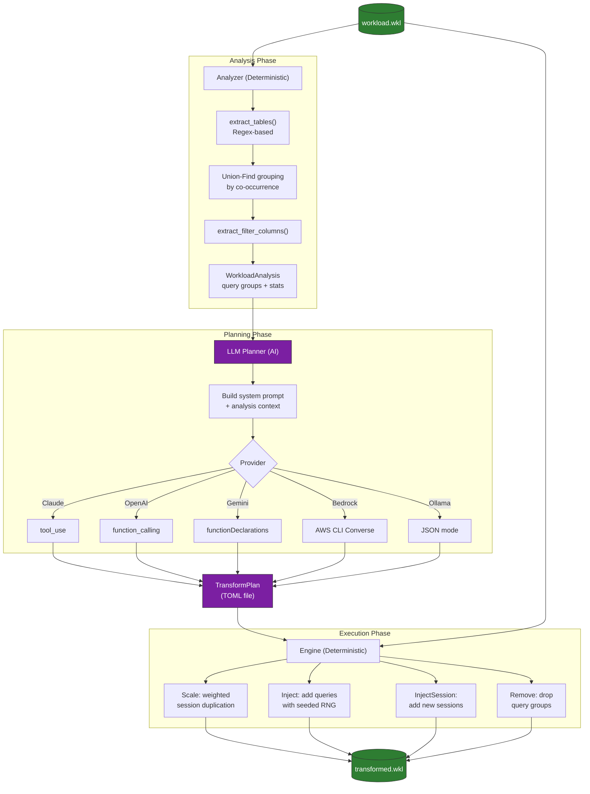

**Key design principle:** AI is advisory only. The LLM generates a TOML plan (a human-reviewable intermediate artifact). The deterministic engine executes it. Given the same plan and seed, the output is always identical. This makes the process auditable and reproducible.

### 6. AI-Assisted Tuning

The tuner runs an iterative loop: collect database context, get LLM recommendations, validate safety, apply, replay, compare, and auto-rollback on regression.

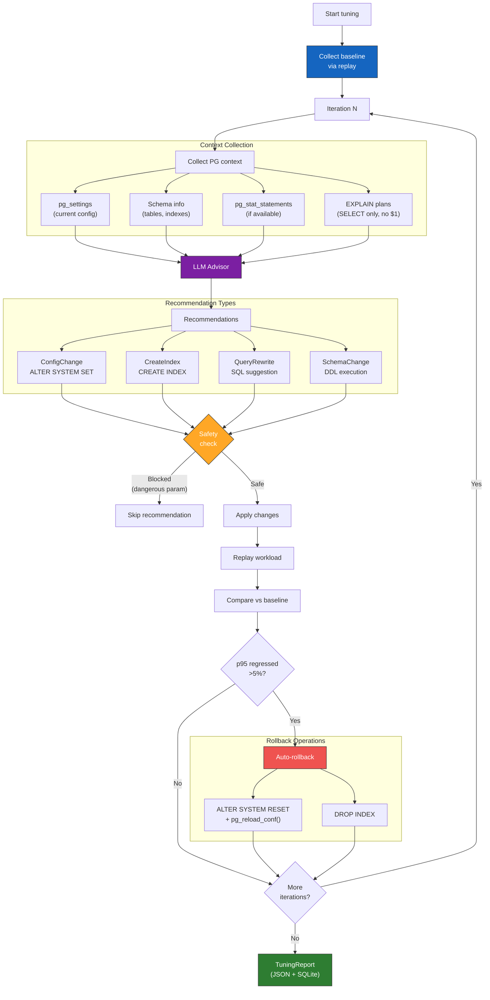

## Workload Profile Format

Workload profiles use MessagePack binary serialization (via `rmp_serde`) and are stored with the `.wkl` extension.

### Structure

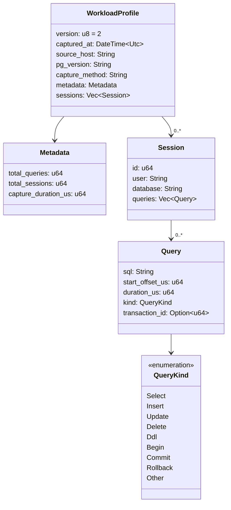

### Version History

- **v1**: Original format. `Query` has no `transaction_id` field.
- **v2**: Adds `transaction_id: Option<u64>` to `Query`. v1 files deserialize cleanly because the field uses `#[serde(default)]`, which defaults `Option<u64>` to `None`.

### Why MessagePack

MessagePack was chosen over JSON, Protobuf, and other formats because it is:

- **Compact**: Binary encoding is typically 30-50% smaller than JSON.
- **Fast**: Serialization/deserialization is faster than JSON parsing.
- **Portable**: No schema compilation step (unlike Protobuf). Works with serde derives.
- **Self-describing enough**: Can be inspected via `pg-retest inspect file.wkl`, which deserializes and prints as JSON.

## Pluggable Capture Backends

All capture backends produce the same output: a `WorkloadProfile`. The profile format, replay engine, and comparison logic know nothing about how the workload was captured.

### How to Add a New Capture Source

1. Create `src/capture/new_source.rs`.
2. Implement a struct that parses the source format and produces `Vec<Session>`.
3. Each `Session` needs an `id`, `user`, `database`, and `Vec<Query>`.
4. Each `Query` needs `sql`, `start_offset_us` (relative to first query in the session), `duration_us`, and `kind` (use `QueryKind::from_sql()` to classify).
5. Call `assign_transaction_ids()` on each session's queries to populate `transaction_id`.
6. Construct and return a `WorkloadProfile` with appropriate metadata.
7. Add `pub mod new_source;` to `src/capture/mod.rs`.
8. Add a new `source_type` match arm in `cmd_capture()` in `src/main.rs`.
9. Add to `CaptureConfig.source_type` validation in `src/config/mod.rs` if pipeline support is needed.
10. Write integration tests in `tests/`.

The key contract: the capture backend maps source-specific log/event formats into the normalized `Session`/`Query` model. Everything downstream is format-agnostic.

## SQL Transform Pipeline

The transform pipeline converts SQL from a non-PG source into PG-compatible syntax. It uses a composable chain of `SqlTransformer` trait implementations.

### Architecture

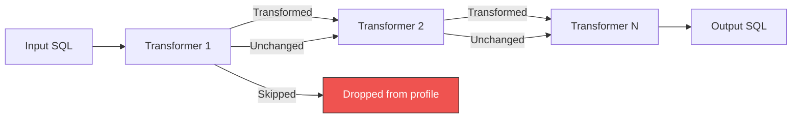

### Key Types

- `SqlTransformer` trait: `fn transform(&self, sql: &str) -> TransformResult`. Each transformer declares a `name()` for reporting.
- `TransformResult`: Three variants -- `Transformed(String)` (SQL was rewritten), `Skipped { reason }` (SQL should be dropped from the profile), `Unchanged` (SQL is already PG-compatible).
- `TransformPipeline`: Chains transformers. A `Skipped` result from any transformer short-circuits the pipeline.
- `TransformReport`: Aggregates results (total, transformed, unchanged, skipped counts) with skip reason tracking.

### Why Regex Instead of a SQL Parser

The transforms use regex (not `sqlparser` or another AST-based parser) because:

- **Simpler**: Each transform is a self-contained regex replacement. No AST construction/traversal.
- **Sufficient**: Covers approximately 80-90% of real MySQL queries in practice.
- **Faster**: No parsing overhead for the common case (most queries need zero or one transform).
- **Known limitations are acceptable**: Backtick replacement inside string literals may mis-fire. Only one LIMIT rewrite per query. These edge cases are documented and reported via `TransformReport`.

### How to Add a New SQL Transform

1. Create a struct implementing `SqlTransformer` in the appropriate module (e.g., `src/transform/oracle_to_pg.rs`).
2. Implement `transform()` to return `Transformed`, `Skipped`, or `Unchanged`.
3. Implement `name()` with a descriptive identifier.
4. Add the transformer to the pipeline in the capture backend that uses it (see `MysqlSlowLogCapture` for the pattern).
5. Write unit tests for each transform rule and integration tests for the pipeline.

## Proxy Architecture

The proxy sits between PostgreSQL clients and the server, capturing live traffic into a workload profile.

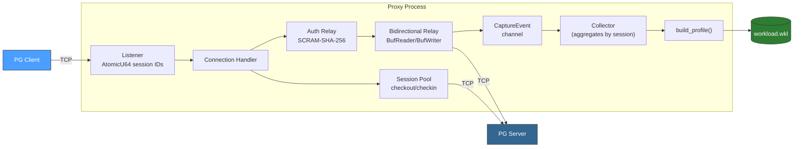

### Wire Protocol Handling

The proxy parses PG wire protocol messages at the frame level (`PgMessage`). It does not interpret most message content -- it simply relays bytes between client and server. The exceptions:

- **Startup phase**: Identifies SSLRequest, CancelRequest, and StartupMessage. Extracts user/database from startup parameters.
- **Query messages**: Extracts SQL text from Query messages (type `Q`) for capture.
- **Auth messages**: Relays SCRAM-SHA-256 authentication. A critical bug fix: the relay must skip the client read after SASLFinal (type 12) because the server sends ReadyForQuery next, not another auth challenge.
- **ReadyForQuery**: Triggers a flush of the client-side BufWriter to ensure buffered responses are delivered.

### Buffered I/O

The proxy uses `BufReader`/`BufWriter` on relay paths. Server responses are flushed immediately (the server sends multiple messages per query). Client responses are flushed on `ReadyForQuery` boundaries. This batching drops per-query overhead from ~109us to effectively 0us.

### Two Operating Modes

- **CLI mode** (`run_proxy`): Signal-based shutdown (SIGINT + SIGTERM). Writes `.wkl` on exit.
- **Managed mode** (`run_proxy_managed`): CancellationToken-based shutdown for web UI integration. Returns `Option<WorkloadProfile>` to the caller. Accepts a metrics channel for live traffic WebSocket broadcast.

## Web Dashboard Architecture

The web dashboard is an Axum-based HTTP server with WebSocket support, serving an Alpine.js SPA.

### Server-Side Stack

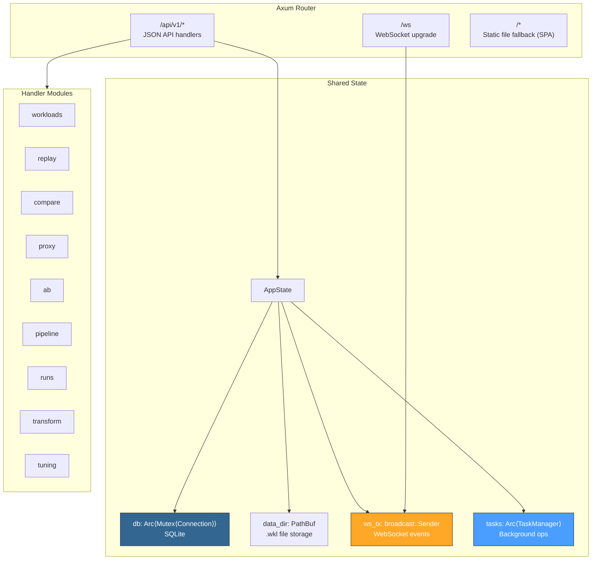

### AppState

`AppState` is the shared state passed to all handlers:

- `db: Arc<Mutex<Connection>>` -- SQLite connection for metadata storage.
- `data_dir: PathBuf` -- Directory for `.wkl` files and the SQLite database.
- `ws_tx: broadcast::Sender<WsMessage>` -- Broadcast channel for pushing events to all WebSocket clients.
- `tasks: Arc<TaskManager>` -- Manages background tasks (proxy, replay, pipeline).

### TaskManager

Background operations (proxy capture, replay, pipeline execution) run as Tokio tasks managed by `TaskManager`. Each task receives:

- A `CancellationToken` for graceful shutdown.
- A task ID (UUID) for status queries and cancellation.

The manager tracks running tasks, supports cancellation, and cleans up finished tasks.

### WebSocket Events

The `WsMessage` enum defines all server-to-client events:

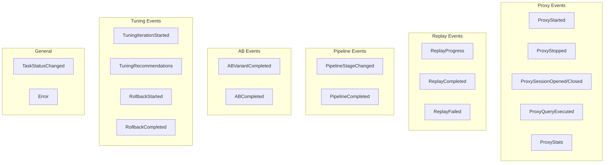

Messages are broadcast to all connected WebSocket clients. The frontend subscribes on page load and updates the UI reactively.

### SQLite Storage

SQLite stores metadata only. The `.wkl` files on disk remain the source of truth for workload data. SQLite tracks:

- Workload records (name, path, session/query counts, created timestamp).
- Run records (type, status, results, timestamp).
- Proxy session records (session IDs, query counts, durations).
- Threshold evaluation results.
- Tuning reports (provider, iterations, improvements, full report JSON).

### Static File Embedding

Frontend files (HTML, JS, CSS) live in `src/web/static/` and are compiled into the binary via `rust-embed`. This means:

- The binary is self-contained -- no separate file server needed.
- Changes to frontend files require recompilation.
- SPA routing works via fallback: any non-API, non-file route serves `index.html`.

### Frontend Stack

- **Alpine.js**: Reactive UI framework loaded via CDN. No build step.
- **Chart.js**: Graphs for latency distributions, trends, capacity reports.
- **Tailwind CSS**: Utility-first styling via CDN.
- **JetBrains Mono**: Monospace font for data tables and code.
- **DM Sans**: UI text font.

## Key Design Decisions

### Why Tokio for Replay

Connection-level parallelism is critical for realistic replay results. A production workload might have 50+ concurrent connections running queries simultaneously. Serializing them would produce meaningless latency numbers. Tokio's async runtime spawns one task per session, each with its own database connection, maintaining real concurrency patterns.

### Why MessagePack for Profiles

See the "Why MessagePack" section under Workload Profile Format above. The short version: compact binary, fast serde, no codegen step, inspectable via the `inspect` subcommand.

### Why Regex for SQL Transforms

See the "Why Regex Instead of a SQL Parser" section under SQL Transform Pipeline above. The short version: simpler code, sufficient coverage for real workloads, acceptable known limitations.

### Why Docker CLI Instead of Bollard

The Docker provisioner shells out to `docker run`, `docker exec`, and `docker rm` via `std::process::Command`. Using the bollard crate (a Rust Docker API client) was considered but rejected because:

- **Fewer dependencies**: bollard pulls in hyper, tower, and several other crates.
- **Simpler code**: Subprocess calls are straightforward and easy to debug.
- **Sufficient for the use case**: The provisioner runs a handful of Docker commands, not a complex orchestration.

### Why Single Binary

All functionality (capture, replay, compare, proxy, pipeline, web dashboard, transform, tune) ships as a single binary with subcommands. This simplifies deployment, avoids version mismatches between components, and makes the tool easy to install and distribute.

### Why Decoupled Capture and Replay

Capture and replay never run simultaneously against the same database. Capture produces a file; replay consumes it. This is intentional because:

- Transactions change data, which changes query plans. For accurate comparison, you need to restore from a point-in-time backup before replay.
- Capture should have minimal impact on production. Replay can be destructive (it re-executes DML).
- The profile file is portable. You can capture on the production server and replay on a test machine.

### Why AI-in-the-Middle Architecture for Transform

The 3-layer transform design (deterministic analyzer → AI planner → deterministic engine) was chosen because:

- **Auditability**: The TOML plan is a human-readable intermediate artifact that can be reviewed before execution.
- **Reproducibility**: Given the same plan and seed, `apply_transform()` always produces identical output.
- **Safety**: The AI never directly modifies workloads. It only suggests a plan. A human (or automation) approves it.
- **Provider flexibility**: Swapping LLM providers only affects the planner layer. The analyzer and engine are unchanged.

### Why Safety Allowlist for Tuner

The tuner's safety module uses an allowlist (~41 safe PG parameters) rather than a blocklist because:

- **Fail-safe**: Unknown parameters are blocked by default. New dangerous parameters added in future PG versions won't slip through.
- **Production protection**: The hostname check is an additional layer -- even with `--apply`, targets containing "prod", "production", "primary", "master", or "main" are blocked without `--force`.
- **Rollback capability**: Only changes that can be reversed (config via `ALTER SYSTEM RESET`, indexes via `DROP INDEX`) are applied. Schema changes and query rewrites are reported but require manual application.
